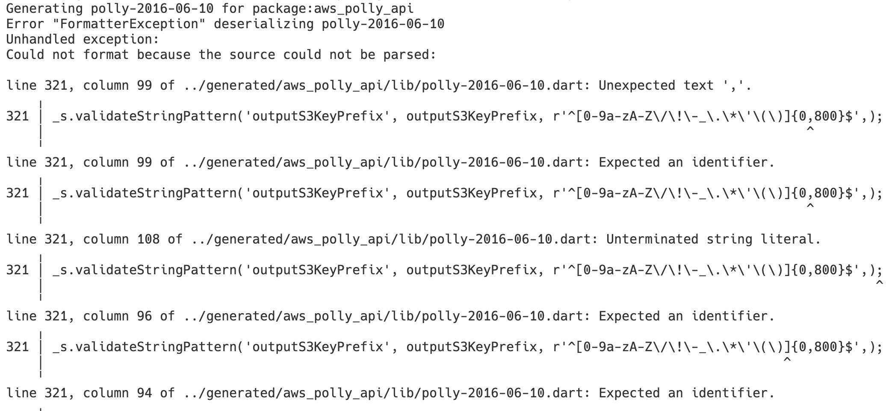
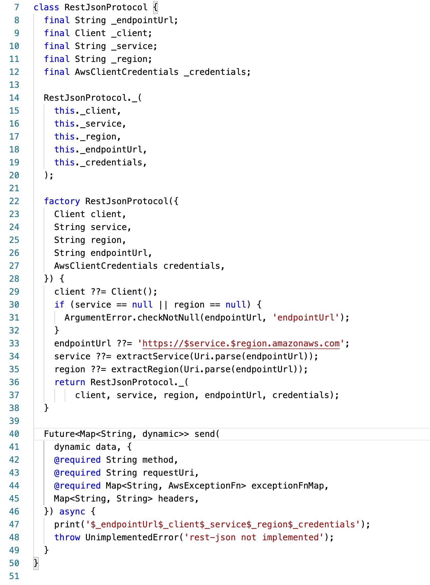
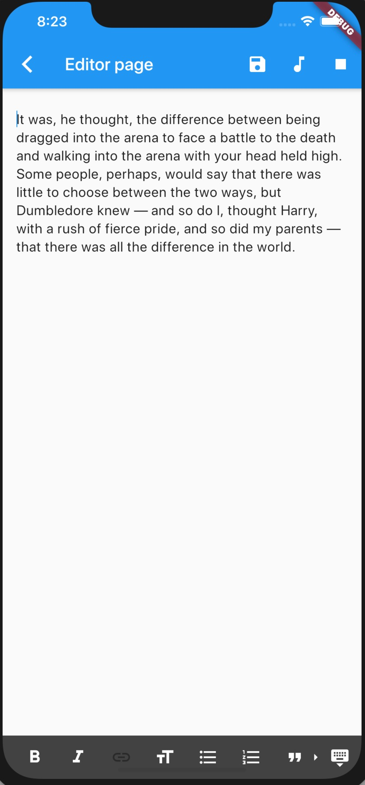
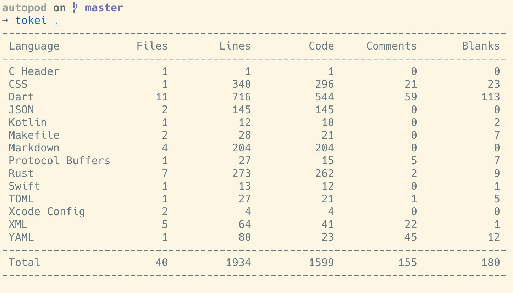

<!-- backgroundColor: #F7F8F8 -->


## Autopod: Challenges & fixes

---

## We need Amazon Polly!

However, almost all 3rd party clients won't have polly built in.
Especially dart...

---

### ~~Roll our own?~~

## Use a code generator!

---

## AWS publish API json definition

[https://api.github.com/repos/aws/aws-sdk-js/zipball/master](https://api.github.com/repos/aws/aws-sdk-js/zipball/master)

We shall learn from it!

---

## I found this nice looking lib: `aws_client` in __pub.dev__...

---

## _brickwall #1_: code won't compile...

---



```json
{
    ...,
    "OutputS3BucketName": {
      "type": "string",
      "pattern": "^[a-z0-9][\\.\\-a-z0-9]{1,61}[a-z0-9]$"
    },
    "OutputS3KeyPrefix": {
      "type": "string",
      "pattern": "^[0-9a-zA-Z\\/\\!\\-_\\.\\*\\'\\(\\)]{0,800}$"
    },
    ...
}
```

---

## The beauty of open source collaboration...

Fork it, fix it, and PR it!

---


The fix is straight forward: [Pull Request](https://github.com/agilord/aws_client/pull/149)

---



## _brickwall #2_

#### turned out `aws_client` is not yet finished for `rest-json`...

---
<!-- backgroundColor: #222831 -->
<!-- color: #fff -->

## Changing of plan...

---

#### Rust + GRPC + flutter

<div class="mermaid">
sequenceDiagram
    User->>Flutter: Play!
    activate Flutter
    Flutter->>User: Play if exists
    Flutter->>Rust: GRPC request
    activate Rust
    Rust->>AWS: JSON request
    AWS->>Rust: JSON response
    Rust->>Flutter: GRPC response
    deactivate Rust
    Flutter->>User: Store and Play!
    deactivate Flutter
</div>

---

## Backend

- rusoto (async AWS client)
- tonic (async GRPC server)
- prost (protobuf code compiler/generator)
- anyhow (error handling)

---



## Client

- audioplayer (mp3 playback)
- crypto (hash function)
- grpc (grpc client)
- protobuf (protobuf compiler)
- zefyr (markdown editor)

---



### Current Status

- MVP
  - UI code: 1/20
  - feature: 1/5 ~ 1/10
- Features to be added:
  - generate podcast feed
  - integration with firebase to store text/mp3 in the cloud
  - integration with netlify to auto-publish

---

## Thank you!


<!-- mermaid.js -->
<script src="https://unpkg.com/mermaid@8.5.0/dist/mermaid.min.js"></script>
<script>mermaid.initialize({startOnLoad:true});</script>
